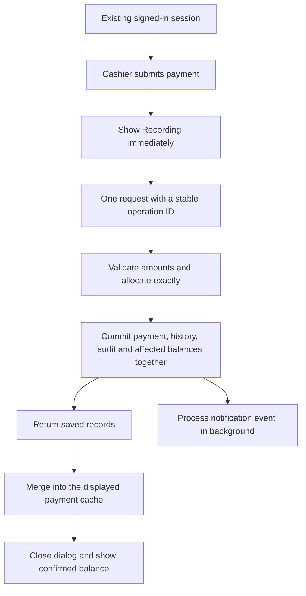

# Application optimization plan — authentication unchanged

**Requested scope:** improve fee recording, Firestore usage, cache correctness and application speed while preserving the current sign-in and authentication behavior.

## Corrected implementation status — 12 September 2026

The unfinished work is now organized into seven acceptance-gated phases in the [remaining-work implementation plan](./remaining-optimization-implementation-plan-2026-09-12.md).

The correctness review found regressions in the earlier package. The previous status overstated completion. See [the behavior review](./optimization-behavior-review-2026-09-12.md) for fixes, verification and remaining limits. The phases below remain the intended plan, not a claim that every acceptance gate has passed.

- **Calculation fixes:** integer carry-forward allocation, native Firestore value preservation and the requirement-tracking contract have focused regression coverage. This is not proof that every legacy error path is fixed.
- **Payment operations:** regular groups, carry-forward groups and uniform tracking use operation records for retry protection. Family regular, carry-forward and uniform allocations now share one financial commit. Individual mixed multi-fee submissions still use separate operations for different payment types. Digital signatures remain separate follow-up writes.
- **Cache ownership:** individual confirmed payments merge with the existing listener by ID; canonical listener records take precedence. Catalog refreshes fetch service data. Previous-balance keys now include actual inputs, not counts. A fully shared family/individual store remains unfinished.
- **Historical loading:** concurrent term-payment/snapshot requests share in-flight work. A later refresh reads again; the new 30-second resolved caches were removed to avoid stale remote updates. Class ended-term loading batches snapshots. Family loading retains its original pupil-scoped snapshot behavior; the attempted schoolwide family snapshot optimization was reverted. Family previous balances were already a query in the baseline.
- **Banking:** standard transactions, standard loan creation, enhanced transactions, reversals and cancellation use current document reads inside transactions. The unsupported Web SDK transaction query calls were corrected. Enhanced loan creation and other legacy multi-step banking paths still need migration; stable banking operation IDs remain unfinished.
- **Notifications and SchoolPay:** grouped notification preparation shares lookups and isolates per-allocation lookup failures. Delivery remains best-effort after response; there is no durable outbox/retry worker. SchoolPay uses receipt-derived payment operations and retains its signature/recovery checks.
- **Startup:** development-only loading of React Query tools is implemented. Production profiling, larger startup changes and table scaling are not complete.
- **Remaining plan work:** pure historical calculator/dependency loading, scoped collection reads, versioned summaries and reconciled backfill, durable notifications, complete banking retry protection, durable pending-payment recovery across reloads, and measured browser/production acceptance checks.
- **Scope:** authentication implementations and checked payment-screen JSX remain unchanged. Error feedback was corrected where a committed payment could be described as failed. No live payments or historical records were modified by the review.

Based on the [11 September audit](C:/Users/hp/Desktop/Trinity-Family-school-main/reports/application-performance-and-firestore-audit-2026-09-11.md). Its caller-authentication and Firestore authorization changes are excluded from this plan. That finding remains documented, but resolving it is not a prerequisite imposed on these performance improvements.

## Scope boundary

- Do not change sign-in, token/session handling, authentication providers, current permission checks, middleware or Firestore authorization rules.
- Do not add user authentication, token verification, a `system_users` lookup or a new login prompt before each payment.
- Keep the existing `ensureServerFirestoreAuth()` connection setup and its reuse behavior unchanged. It already exists in the route; this plan neither adds it nor removes it.
- Retain existing receiving-staff/session metadata for receipts and audit records. Moving audit persistence into a payment transaction does not introduce a new identity check or change how identity is established.
- Keep amount, allocation and duplicate-operation validation. These check the financial data, not the user's sign-in.
- Preserve fee assignment coverage, discounts, historical class/section, reversals, existing SchoolPay reconciliation and current parent data scopes.

## Intended payment flow

The existing server connection setup remains inside the request as it is today. No new authentication step is introduced in this flow. Database confirmation still requires a network round trip; immediate feedback is the pending state, followed by confirmed success when the commit is acknowledged.

## Phase 0 — establish a baseline and protect the scope

**Work**

1. Record current click-to-feedback, HTTP time, payment commit, signature wait and balance-update time for regular, uniform, family and carry-forward payments.
2. Reuse the current `Server-Timing` instrumentation; add precise non-identifying performance marks around the remaining stages.
3. Measure returned-document counts, listener lifetime, refresh causes and cache hits for fee screens. Client call counts are diagnostic estimates, not a complete billing measurement.
4. Keep the existing mixed worktree intact. Implement later phases in an isolated checkout and review exact paths.
5. Record the excluded authentication files/behaviors in the change scope, and check diffs and request traces for accidental new authentication work.

**Completion:** a baseline table for cold/warm screens and each payment type, plus focused regression fixtures. Current audit evidence already includes 22 passing selected tests; the broad typecheck/lint failures require separate triage and are not treated as passes.

## Phase 1 — repair financial calculations and immediate correctness defects

**Work**

- Replace independent rounding of carry-forward shares with deterministic integer allocation whose sum equals the submitted amount.
- Preserve Firestore Timestamp and other supported native values when removing undefined fields.
- Correct the requirement-tracking argument contract and remove its duplicate method implementation.
- Distinguish a successful empty query from a failed read. Keep last-confirmed balances with an error/stale state instead of replacing failed payment data with zero.
- Fix collection processing identity using pupil IDs and input versions, rather than array lengths. Cancel obsolete filter work and publish only the latest result.

**Main files:** `carryForwardPayments.ts`, `payments.service.ts`, `use-requirement-tracking.ts`, `requirement-tracking.service.ts`, `use-progressive-fees.ts`, family/individual fee hooks.

**Completion:** UGX 100 and 101 retain their exact totals; two equal-sized classes show their own records; failed reads cannot produce a false unpaid balance; requirement filters receive the correct IDs.

**Audit coverage:** F05, F10, F11, F15, F18.

## Phase 2 — consolidate payment recording into one durable operation

**Work**

1. Extend the existing payment endpoint to accept one operation ID and a bounded list of allocations. Preserve its current authentication behavior and legacy request compatibility during rollout.
2. Generate the ID once per intended cashier submission. Reuse it after a connection timeout or retry. Store a fingerprint of the financial payload and the committed result; reject a changed payload using an already-used ID.
3. Commit the payment allocations, required history, signature/audit records and affected uniform tracking together. Use a transaction where current state determines the update. Read the necessary documents before writing.
4. Move the existing audit record construction into reusable builders. Carry the existing client session/device metadata so receipts and audit views retain the same information. Remove the extra browser signature commit only after its records are written by the new operation.
5. Replace the sequential carry-forward loop and independent family/multi-fee writes with this grouped operation. Adapt regular payments first, then multi-fee/carry-forward, uniform and family flows.
6. Return canonical saved records and operation status. A retry with the same ID resolves a lost response without creating another payment. Keep the pending ID only as a retry reference, scoped to the existing session/pupil; do not introduce an automatic offline payment queue.
7. Bound allocation count to the transaction's practical limits. Reject oversize interactive requests before writing; any future large import requires explicit durable job status rather than partial saves disguised as one success.

**Main files:** existing payment route/service, collection and family submit handlers, uniform integration, carry-forward utilities, digital-signature/history builders. Add a server-only operation service while retaining the current server connection mechanism.

**Read tradeoff:** duplicate prevention needs an operation-document lookup, and concurrent balance protection needs the affected balance/tracking reads. These are financial consistency reads, not authentication reads. Savings come from eliminating repeated requests and broad reloads—not promising that a correct payment requires zero reads.

**Completion:** retry returns the original payment IDs; concurrent uniform payments preserve both amounts; a grouped failure cannot leave an undisclosed partial payment; audit/receipt views still work; no new authentication requests or user lookups appear.

**Audit coverage:** F02, F03, F06. F01's authentication changes remain excluded.

## Phase 3 — connect saved payments to one shared cache

**Work**

- Make one pupil-scoped payment store serve the collection screen, family view and relevant receipt consumers. Preserve existing account scope and cache-clearing behavior.
- Have both the mutation response and Firestore listener merge into it by payment ID. A listener echo must replace/confirm an existing record, not add it twice.
- Close the dialog once the grouped commit succeeds; update the visible totals from those saved records immediately. Avoid waiting for the listener to deliver the same payment again.
- Remove invalidations targeting retired keys and remove catalog/snapshot refetches triggered merely by adding a payment.
- Make cached data available immediately while ensuring explicit refresh fetches authoritative data. Correct this in fees, uniforms and requirements.
- Consolidate fee catalogs under one owner. Derive class/year/term selections locally using the existing applicability rules.
- Replace length-based previous-balance cache keys with real input versions, or compute directly from current cached inputs. Include remote reversals, edits, discounts and holiday changes.

**Completion:** confirmed payments change the displayed balance without a full refetch; a returned record plus listener echo appears once; changing a fee from another device updates the right calculation; adding a payment triggers no fee-catalog refresh.

**Audit coverage:** F04, F07, F09, F12.

## Phase 4 — remove repeated historical reads and scale collection views

**Part A: improve existing calculations first**

- Split carry-forward data loading from arithmetic. Supply payments, catalogs, holidays, uniform tracking and historical pupil information explicitly to a pure calculator.
- Reuse dependencies already loaded for the pupil. Load missing snapshots once with bounded concurrency or an appropriate pupil-scoped query.
- Cache historical snapshots with an explicit recapture/version signal. Reversing a payment should recalculate the balance from cached history, not reload every past period.
- On class selection, fetch only the relevant pupil/term payment scope where supported by existing query/rule contracts. Keep an explicit whole-school reporting path.

**Part B: introduce summaries when the loader is correct**

- Maintain pupil/year/term summaries for collection rows: assessed fees, discounts, amount paid, balance, last payment and source version.
- Update payment-dependent totals in the payment operation. Fee, assignment, holiday and historical corrections need versioned recalculation; show a pending/stale summary until complete.
- Backfill summaries with a resumable job and compare them with ledger calculations before switching the list to them.
- Keep paginated payment history for details and receipts. Do not discard historical payments because the list now uses summaries.
- Avoid a school-wide mutable counter on every payment; isolate writes by pupil/period.

**Completion:** warm carry-forward recalculation performs no new historical reads when its dependencies are unchanged; a class collection screen no longer downloads the whole school's term ledger; every migrated summary reconciles with the established calculation.

**Audit coverage:** F08, F13.

## Phase 5 — optimize banking, notifications and SchoolPay

**Banking:** apply transactional balance updates and stable operation IDs to withdrawals, deposits, loans and reversals. Preserve current access/authentication behavior. Verify that two withdrawals cannot independently spend the same opening balance. Audit coverage: F14.

**Notifications:** save a durable notification event alongside the payment operation. Include the calculated post-payment balance and receipt metadata, avoiding a new history scan merely to compose a message. Process events after confirmation, with deduplication, retry status and bounded execution. Coalesce allocations belonging to one receipt. Reuse notification settings and recipient data with existing freshness/permission behavior preserved. Do not make notification retries part of the cashier's wait. Audit coverage: F16–F17.

**SchoolPay:** retain its current webhook authentication, receipt uniqueness, inbox leases and recovery/conflict checks unchanged. Reuse years, catalogs and settings within a bounded processing run. Call the common financial operation service after those existing checks; preserve mapping and receipt consistency. Process independent pupils with bounded concurrency, while protecting operations affecting the same pupil. Audit coverage: F20.

**Completion:** banking changes use Firestore transactions for each current balance-changing command; delayed notification delivery does not delay fee confirmation; grouped notifications reuse recipient-policy reads; repeated SchoolPay processing replays the original allocations without weakening existing signature, mapping or recovery checks.

## Phase 6 — reduce startup and rendering work

**Work**

- Start secondary catalogs and photo data on route intent/first use where they are not needed for the initial dashboard.
- Reuse existing revision-aware caches and shared listeners. Preserve current real-time pupil and parent behavior; do not add polling to compensate for incomplete cache ownership.
- Keep sign-in/dashboard visual handoff independent of full data loading.
- Profile large collection/pupil tables, then add pagination or virtualization where needed.
- Compare a fresh production bundle against the custom shared-vendor configuration before choosing a bundling change. Existing development bundle sizes are not the production baseline.
- Load appropriate image sizes, defer print-only assets/fonts and retain on-demand PDF imports.
- Gate verbose production logs. Use a worker for fee calculations only if profiling still shows meaningful main-thread blocking after the pure-calculator refactor.
- Triage TypeScript/lint failures by runtime risk, then expand release checks. Do not treat suppressing diagnostics as a performance improvement.

**Completion:** measured cold/warm navigation, downloaded bytes and table interaction improve, with current auth/session, offline-cache, print and parent behaviors preserved.

**Audit coverage:** F19, F21.

## Delivery sequence and acceptance gates

| Delivery | Depends on | Main benefit | Gate before rollout |
|---|---|---|---|
| Baseline and scope | None | Reliable comparison | Existing authentication unchanged |
| Calculation/error fixes | Baseline | Correct amounts and honest balances | Reproductions become passing regression tests |
| Grouped payment operation | Calculation fixes | Fewer serial requests; safe retry | Concurrency, partial-failure, receipt and audit tests |
| Shared payment/catalog cache | Grouped response contract | Immediate confirmed balances; fewer reloads | Mutation/listener merge and remote-change tests |
| Historical loading | Shared ownership | Fewer reads and faster carry-forward | Historical parity and zero redundant warm reads |
| Collection summaries | Correct calculator and payment operation | Smaller class/list queries | Backfill reconciliation and stale-summary handling |
| Banking/integration changes | Operation primitives | Consistent balances and background work | Existing SchoolPay recovery and notification tests |
| Frontend refinement | Production baseline | Faster startup and interaction | Measured before/after production-mode comparison |

Suggested performance goals are immediate pending feedback within 100 ms and warm regular payment confirmation visible within one second at p95 on the agreed test network. These are goals, not guaranteed results; database/network latency must be measured. The architectural acceptance criterion is stronger: one financial command, no second browser audit write, no broad refetch before success, and no added authentication work.

Roll out in small, reviewable changes. Retain operation IDs across compatibility paths once introduced so a fallback cannot bypass duplicate protection. Do not rewrite financial history during rollback. Switch summary readers back to the ledger calculation if reconciliation fails. Historical duplicate payments or inconsistent tracking require a separate reviewed reconciliation, not automatic deletion.

**Recommended starting package:** Phase 1, followed by Phases 2 and 3. This addresses the fee-recording delay and its correctness defects before the larger reporting and startup work. Every proposed authentication change from the original audit remains outside this implementation scope.
